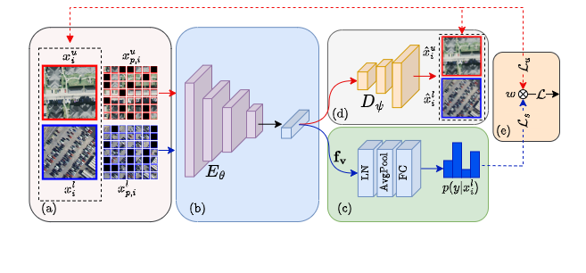

# SSL-MAE
SSL-MAE: Adaptive Semi-Supervised Learning Framework for Multi-Label Classification of Remote Sensing Images Using Masked Autoencoders

This repository contains PyTorch implementation of the following paper: 
Stoimchev, M., Ivanovskа, M., Štruc, V. Learning to Combine Local and Global Image Information for Contactless Palmprint Recognition
(This is an initial version, the code will be updated)

# The SSL-MAE (TPA)

