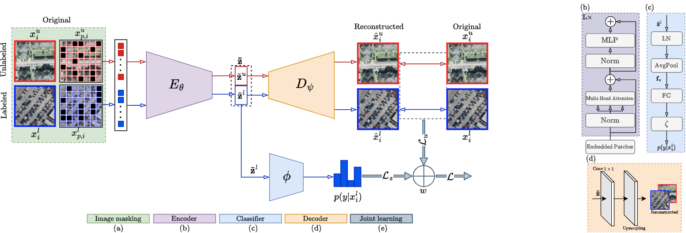

# SSL-MAE: Adaptive Semi-Supervised Learning Framework for Multi-Label Classification of Remote Sensing Images Using Masked Autoencoders

This repository contains the official implementation of our paper **"SSL-MAE: Adaptive Semi-Supervised Learning Framework for Multi-Label Classification of Remote Sensing Images Using Masked Autoencoders"**.

**Authors:** Marjan Stoimchev, Jurica Levatić, Dragi Kocev, Sašo Džeroski

## Abstract

The increasing volume of remotely sensed imagery (RSI) requires efficient processing and extraction of meaningful information. Modern deep learning architectures excel in various tasks but typically require large labeled datasets, which are often scarce in RSI due to the tedious labeling of complex heterogeneous landscapes containing multiple semantic categories. This can limit the potential of supervised deep learning methods. To address this, we propose SSL-MAE, a novel semi-supervised learning method based on a masked autoencoder. Our approach unifies self-supervision and discriminative learning within a single, end-to-end framework, leveraging both abundant unlabeled data and limited labeled data. Additionally, we introduce an adaptive mechanism to control the level of supervision during learning, crucial for balancing prediction quality with effective use of unlabeled data.

## Methodology

<div align="center">
  
</div>

SSL-MAE integrates self-supervised and supervised learning within a unified masked autoencoder framework consisting of five key components:

### 1. Image Masking
Each input image (labeled or unlabeled) is divided into non-overlapping patches, with a fraction randomly masked to create a reconstruction-based pretext task that drives robust representation learning from partial visual data.

### 2. Vision Transformer Encoder
A DeiT-based encoder processes visible patches into latent embeddings, leveraging global modeling capabilities of self-attention for large-scale visual data processing.

### 3. Classification Head
Only latent representations from unmasked patches of labeled images are passed to a lightweight classification head. These embeddings are aggregated using average pooling and processed through a fully connected layer with sigmoid activation for multi-label classification.

### 4. Lightweight Decoder
Following SimMIM design, a lightweight decoder reconstructs pixel intensities of masked patches using ℓ₁ regression loss for both labeled and unlabeled samples, providing direct self-supervised signal for enhanced feature learning.

### 5. Adaptive Joint Learning
Model parameters are updated via weighted combination of supervised and unsupervised losses:


We investigate two strategies for the weight parameter w:
- **Grid Search (SSL-MAE-GS)**: Optimal w selected via validation performance
- **Learnable Weight (SSL-MAE-wₗ)**: w parameterized as trainable sigmoid function

The adaptive mechanism allows the network to automatically balance reliance on labeled vs unlabeled data, enabling effective exploitation of abundant unlabeled data while emphasizing discriminative learning as needed.

## Key Features

- **Unified End-to-End Framework**: Combines self-supervised and supervised learning without two-stage training
- **Adaptive Supervision Control**: Dynamic balancing of supervision levels during training
- **Multi-Label Support**: Specifically designed for complex multi-label remote sensing classification
- **Transferable Design**: Adaptive joint learning can enhance other self-supervised methods
- **Data Efficient**: Effective performance with limited labeled data (as low as 1%)

## Installation

```bash
git clone https://github.com/marjanstoimchev/SSL-MAE.git
cd SSL-MAE

# Create conda environment
conda create -n ssl-mae python=3.8
conda activate ssl-mae

# Install PyTorch
pip install torch torchvision torchaudio --index-url https://download.pytorch.org/whl/cu118

# Install dependencies
pip install -r requirements.txt
```


@article{stoimchev2024ssl_mae,
  title={SSL-MAE: Adaptive Semi-Supervised Learning Framework for Multi-Label Classification of Remote Sensing Images Using Masked Autoencoders},
  author={Stoimchev, Marjan and Levatić, Jurica and Kocev, Dragi and Džeroski, Sašo},
  journal={IEEE Journal of Selected Topics in Applied Earth Observations and Remote Sensing},
  year={2025}
}
